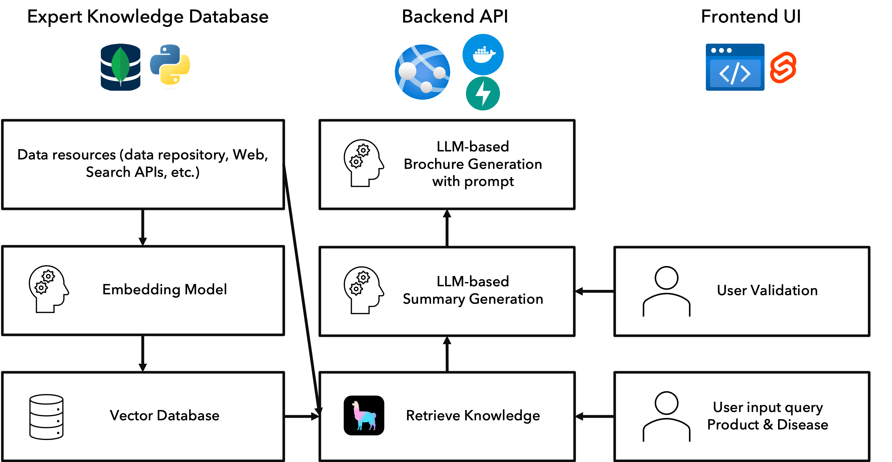
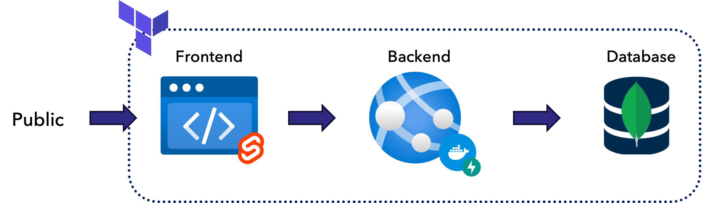

# Pharma Pro Link (PPL)
A full-stack application that collects relevant information from search APIs (e.g., PubMed), creates latent embedding vector using embedding models, and provides a user-friendly interface for users to search and explore the information, then create readable report utilizing LLMs.

## Project objective
- Extract expert knowledge and store it in a database.
- Retrieve expert knowlege efficiently.
- Generate a reliable summary of the expert knowledge.
- Generate a readable marketing brochure out of it.
- Provide a user-friendly interface for users to search and explore the information.

## Workflow


## Project Structure
```
./services
    ./backend
    ./frontend
./tfconfig
./scripts
```

## Installation
### Frontend
```
make env-ui
```
### Backend
```
make env-api
```

## Services
A full-stack application with frontend and backend services.
### Frontend
- Svelte
- User interface to get input from users and display search results.
### Backend
- FastAPI + Docker
- Collects information from search APIs (e.g., PubMed).
- Creates index using [Llama-index](https://docs.llamaindex.ai/en/stable/getting_started/concepts.html) and embedding models.
- RAG (Retrieval Augmented Generation) approach and llms (e.g., Llama2-7B) to generate expert-knowledge include summary.
- Provides a user-friendly interface for users to search and explore the information.
- Creates readable report out of it.

## Azure infrastructure
- Azure Static Web Apps
- Azure App Service
- Azure MongoDB (vector database)
- Azure ML studio (Language model and embedding model)
- Azure Container Registry



## Development
### Frontend
```
make run-ui
```
### Backend
```
make run-api
```

## Error Handling
You might need to set the following environment variable to avoid the error message `OMP: Error #15: Initializing libiomp5.dylib, but found libiomp5.dylib already initialized.`:
```bash
export KMP_DUPLICATE_LIB_OK=TRUE
```
